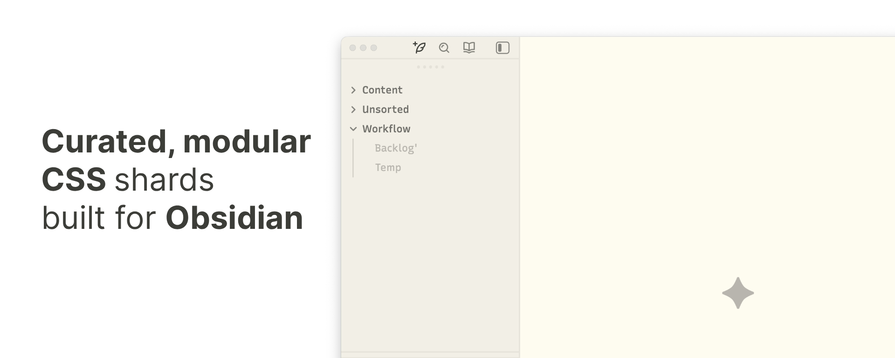

Built with SCSS, each "shard fragment" is a modular component designed to enhance specific UI elements, optimizing the interface for productivity and visual clarity.

 

- [Features](#features)
- [Development](#development)
  - [Quick Start](#quick-start)
  - [Continuous Build](#continuous-build)
- [Credits](#credits)
- [License](#license)

 

## Features

Consider using [Recursive Sans Linear](https://www.recursive.design/), which complements the design and enhances readability.

- **Command Palette**: Custom adjustments for improved navigation and user focus within the interface
- **Enhanced Core UI**: CSS modifications to hide unnecessary elements - no Hider plugin required anymore
- **Settings**: Streamlined vertical navigation and enhanced highlighting for external plugins
- **New Tab**: Redesigned empty state for new tabs page
- **Editor**: Active line indicator for improved focus
- **Bullet Lists**: Animated transitions for collapsed list bullets
- **Unique Checkbox**: Animated playful transitions
- **External Links**: Addition of Unicode symbols for enhanced recognition
- **Internal Links**: Subtle opacity adjustments for a cleaner interface.
   ...

## Development

Built with SCSS. Modules in [src/](https://github.com/visua1hue/obsidian-shards/tree/main/src), compiled output in [dist/](https://github.com/visua1hue/obsidian-shards/tree/main/dist).

Each shard is a separate module - comment out unwanted `@use` statements in the main SCSS file to exclude specific features from compilation.

### Quick Start

- Run `npm install && npm run build` to compile.
- Copy `dist/shard-fragments.css` to `.obsidian/snippets/`.

### Continuous Build

- Use `npm run watch` for live recompilation.

## Credits

This repository includes snippets and inspirations from various sources. Arigato (ありがとう) to:

- [@chrisgrieser · Shimmering Focus](https://github.com/chrisgrieser)
- [@kepano · Minimal](https://github.com/kepano)
- [@AnubisNekhet · AnuPpuccin](https://github.com/AnubisNekhet)

## License

Built for personal use only, from MIT-licensed sources (see [Credits](#credits)). **Not intended for, and will not be submitted to**, the [Obsidian](https://obsidian.md/) store.
