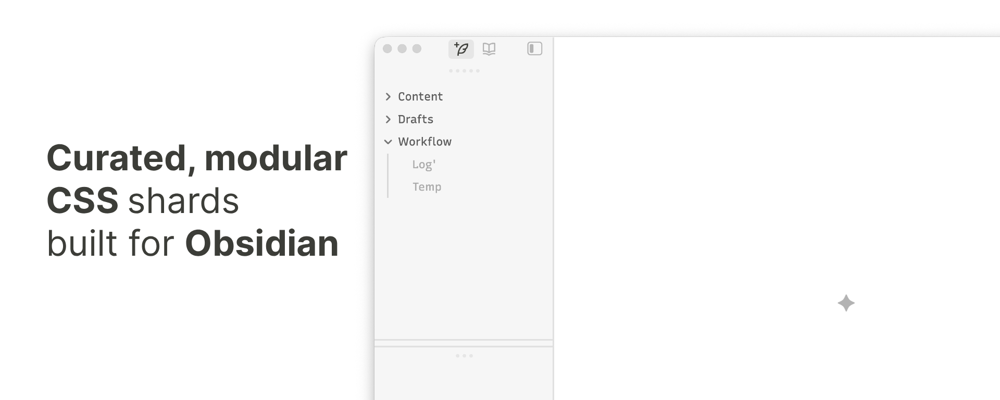
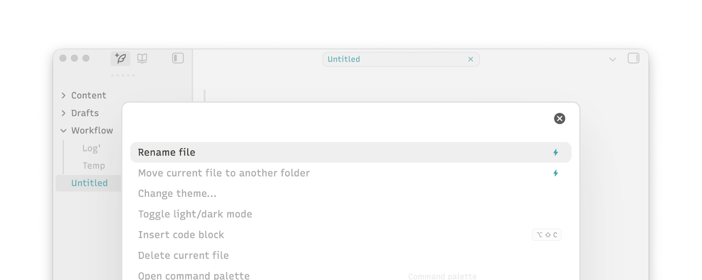
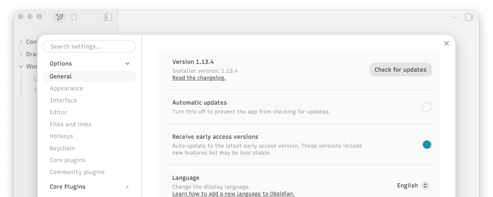
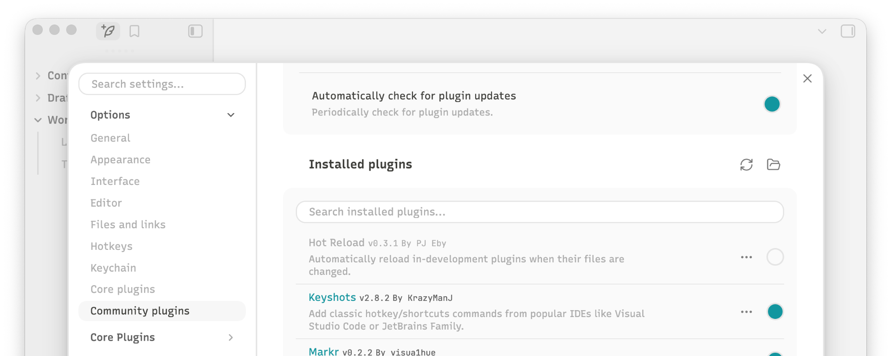
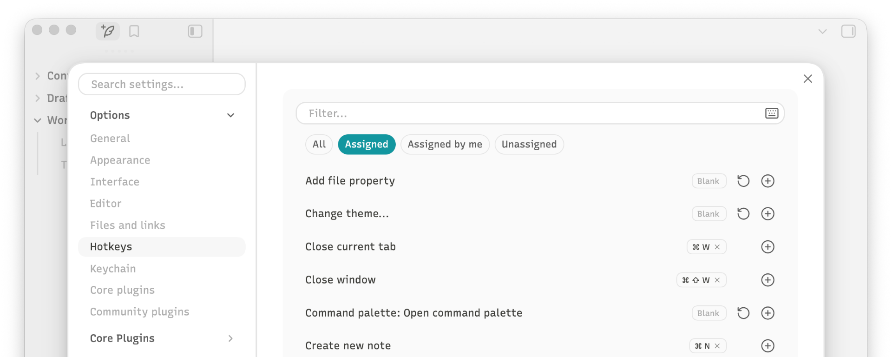
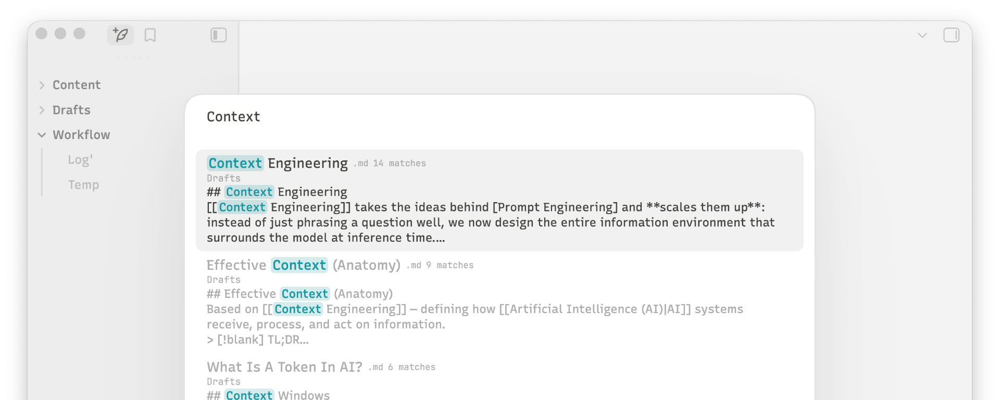

Built with SCSS, each "shard fragment" is a modular component designed to enhance specific UI elements, optimizing the interface for productivity and visual clarity.

Consider using [Recursive Sans Linear](https://www.recursive.design/), which complements the design and enhances readability.

 

- [Features](#features)
  - [Command Palette](#command-palette)
  - [Settings](#settings)
  - [Plugin: Omnisearch](#plugin-omnisearch)
  - [Enhancements](#enhancements)
- [Development](#development)
  - [Quick Start](#quick-start)
  - [Continuous Build](#continuous-build)
- [Credits](#credits)
- [License](#license)

 

## Features

Keyboard-driven, hotkey-first — Command Palette and Omnisearch, always. Each component is styled to support that flow.

### Command Palette

Focused navigation with reduced visual noise and custom SVG icons for pinned commands.

### Settings

Vertical nav groups that expand on hover and collapse when idle, dimmed inactive plugins, and a hotkeys panel with a new layout that reduces shift.

### Plugin: Omnisearch

Full-vault search with reduced visual noise and focused results.

### Enhancements

Additional refinements applied across the interface:

- **Core UI**: hides unnecessary elements and replaces default icons with custom SVGs
- **New Tab**: redesigned empty state
- **Editor**: active line indicator and playful animated bullet/checkbox transitions
- **Links**: Unicode symbols on external links · subtle opacity on internal links

## Development

Built with SCSS. Modules in [src/](https://github.com/visua1hue/obsidian-shards/tree/main/src), compiled output in [dist/](https://github.com/visua1hue/obsidian-shards/tree/main/dist).

Each shard is a separate module - comment out unwanted `@use` statements in the main SCSS file to exclude specific features from compilation.

### Quick Start

- Run `npm install && npm run build` to compile.
- Copy `dist/shard-fragments.css` to `.obsidian/snippets/`.

### Continuous Build

- Use `npm run watch` for live recompilation.

## Credits

This repository includes snippets and inspirations from various sources. Arigato (ありがとう) to:

- [@chrisgrieser · Shimmering Focus](https://github.com/chrisgrieser)
- [@kepano · Minimal](https://github.com/kepano)
- [@AnubisNekhet · AnuPpuccin](https://github.com/AnubisNekhet)

## License

Built for personal use only, from MIT-licensed sources (see [Credits](#credits)). **Not intended for, and will not be submitted to**, the [Obsidian](https://obsidian.md/) store.
